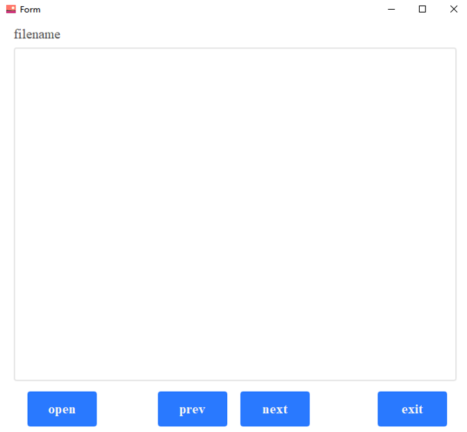

## FLIR A700 raw image viewer
View the raw infrared images captured by FLIR A700  
The images capture tool is available [here](https://github.com/frostcza/FLIR-A700-program)  

### python environment
python 3.7  
PyQt5  5.15.2  
pyqt5-tools  
pyinstaller  

### run 
#### run in python
`python run_raw_viewer.py`  
#### build exe
`pyinstaller -F -w --add-data "custom.css;." --add-data "viewer.ico;." run_raw_viewer.py --hidden-import raw_viewer_ui.py --icon=viewer.ico`  

